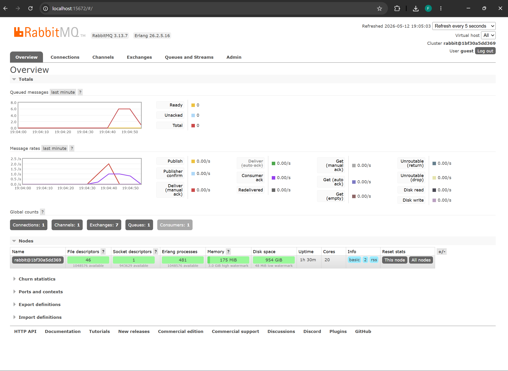
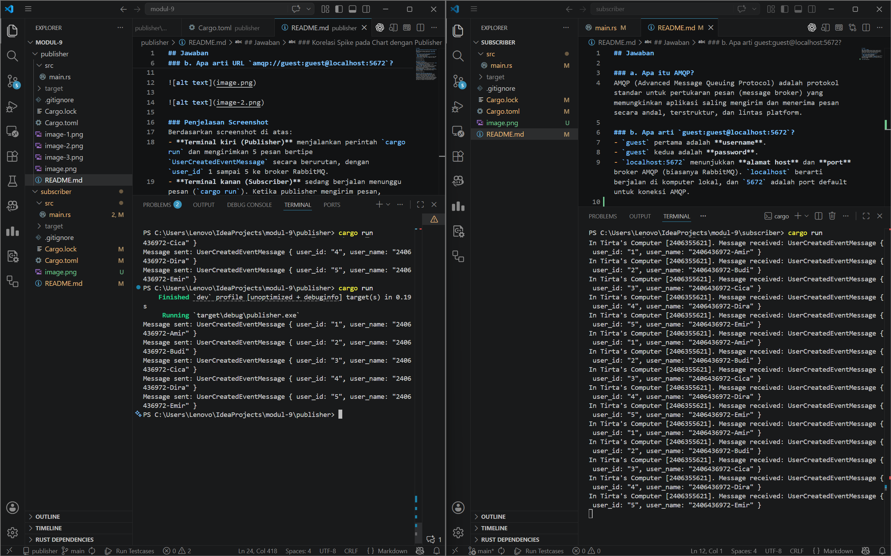
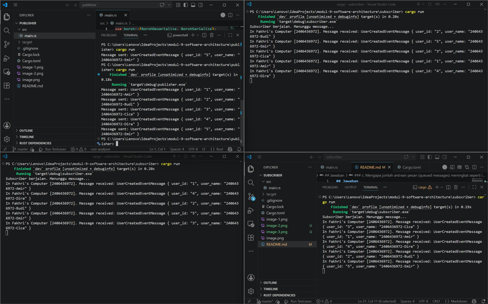

## Jawaban

### a. Apa itu AMQP?
AMQP (Advanced Message Queuing Protocol) adalah protokol standar untuk pertukaran pesan (message broker) yang memungkinkan aplikasi saling mengirim dan menerima pesan secara andal, terstruktur, dan lintas platform.

### b. Apa arti `guest:guest@localhost:5672`?
- `guest` pertama adalah **username**.
- `guest` kedua adalah **password**.
- `localhost:5672` menunjukkan **alamat host** dan **port** broker AMQP (biasanya RabbitMQ). `localhost` berarti berjalan di komputer lokal, dan `5672` adalah port default untuk koneksi AMQP.

### Simulasi Slow Subscriber

**Mengapa terjadi spike pada jumlah antrean pesan (Queued messages)?**
Spike ini terjadi karena *publisher* mengirimkan pesan dengan kecepatan yang sangat tinggi (tanpa jeda), sementara *subscriber* (consumer) sengaja dibuat lambat dengan penambahan delay `thread::sleep(time::Duration::from_millis(1000));` (1 detik per pesan). Akibatnya, kecepatan produksi pesan jauh lebih besar dibandingkan kecepatan pemrosesannya. RabbitMQ akan menampung pesan-pesan yang belum sempat diproses tersebut ke dalam antrean (queue), yang menyebabkan terlihatnya lonjakan (spike) pada grafik *Queued messages*. Pesan-pesan ini akan tetap berada di antrean sampai *subscriber* berhasil memprosesnya satu per satu.