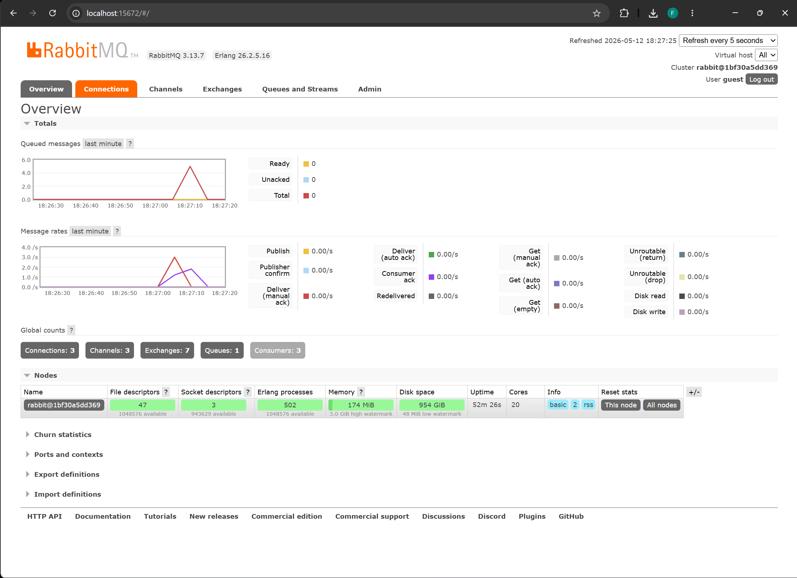

## Jawaban

### a. Apa itu AMQP?
AMQP (Advanced Message Queuing Protocol) adalah protokol standar untuk pertukaran pesan (message broker) yang memungkinkan aplikasi saling mengirim dan menerima pesan secara andal, terstruktur, dan lintas platform.

### b. Apa arti `guest:guest@localhost:5672`?
- `guest` pertama adalah **username**.
- `guest` kedua adalah **password**.
- `localhost:5672` menunjukkan **alamat host** dan **port** broker AMQP (biasanya RabbitMQ). `localhost` berarti berjalan di komputer lokal, dan `5672` adalah port default untuk koneksi AMQP.

### Simulasi Slow Subscriber

**Mengapa terjadi spike pada jumlah antrean pesan (Queued messages)?**
Spike ini terjadi karena *publisher* mengirimkan pesan dengan kecepatan yang sangat tinggi (tanpa jeda), sementara *subscriber* (consumer) sengaja dibuat lambat dengan penambahan delay `thread::sleep(time::Duration::from_millis(1000));` (1 detik per pesan). Akibatnya, kecepatan produksi pesan jauh lebih besar dibandingkan kecepatan pemrosesannya. RabbitMQ akan menampung pesan-pesan yang belum sempat diproses tersebut ke dalam antrean (queue), yang menyebabkan terlihatnya lonjakan (spike) pada grafik *Queued messages*. Pesan-pesan ini akan tetap berada di antrean sampai *subscriber* berhasil memprosesnya satu per satu.

### Simulasi Multiple Subscribers

**Mengapa spike pada message queue (antrean pesan) menurun lebih cepat?**
Ketika menjalankan banyak program subscriber (beberapa konsol secara bersamaan) yang terhubung ke *queue* yang sama, RabbitMQ akan mendistribusikan pesan-pesan tersebut secara **Round-Robin** ke setiap *subscriber* yang aktif. Konsep ini dikenal sebagai pola **Competing Consumers**. 
Dengan adanya lebih dari satu *consumer*, beban pemrosesan pesan dibagi rata secara paralel. Karena lebih banyak *worker* yang melayani antrean tersebut, laju konsumsi pesan (message processing rate) meningkat drastis. Hal ini menyebabkan antrean (spike) dapat terselesaikan jauh lebih cepat dibandingkan jika hanya menggunakan satu *subscriber*.

**Apakah ada yang bisa diperbaiki dari kode publisher dan subscriber?**
Ya. Terdapat *anti-pattern* pada file `src/main.rs` di *subscriber*. 
Kita menyimulasikan delay menggunakan `thread::sleep(ten_millis);` di dalam fungsi *asynchronous* (`async fn main()`). Fungsi `thread::sleep` bersifat **blocking** terhadap *thread OS*. Dalam *runtime async* seperti Tokio, memblokir *thread OS* akan mengeblok keseluruhan _worker thread_, mencegah event/task *async* lain untuk diproses.

**Saran Perbaikan:**
Sebaiknya gunakan fungsi *sleep* milik Tokio yang bersifat *non-blocking* (asinkron).
Ganti: `std::thread::sleep(ten_millis);` 
Menjadi: `tokio::time::sleep(tokio::time::Duration::from_millis(1000)).await;` 
Dengan pendekatan ini, proses akan memberi sinyal kepada *executor* untuk menjeda task saat ini tanpa menghentikan *thread* secara keseluruhan.

